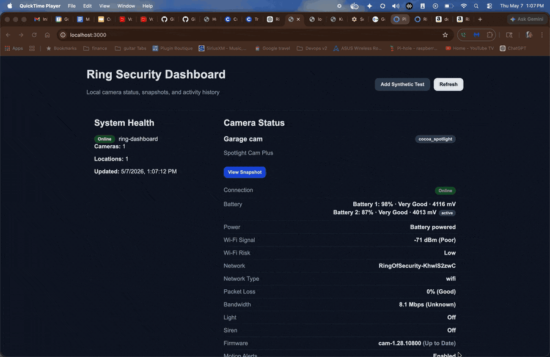

# Ring Dashboard

A local Docker-based dashboard for Ring cameras.

This app lets you view Ring camera status, health metrics, snapshots, and local activity history from a simple web dashboard.

It is designed for local/home-lab use.

## Demo



## What You Need

- Docker Desktop
- Docker Compose
- A Ring account
- A Ring refresh token

You do **not** need to install Node.js to run this with Docker.

## Quick Start

Clone the repo:

```bash
git clone https://github.com/heyseus1/ring-dashboard.git
cd ring-dashboard
```

Create your local environment file:

```bash
cp .env.example .env
```

Generate a Ring refresh token:

```bash
npx -y ring-auth-cli
```

Copy the refresh token into `.env`:

```env
PORT=3000
DATA_DIR=./data
RING_REFRESH_TOKEN=your_ring_refresh_token_here
```

Create the local data directory:

```bash
mkdir -p data
touch data/.gitkeep
```

Start the dashboard:

```bash
docker compose up --build
```

Open the dashboard:

```text
http://localhost:3000
```

Stop the dashboard:

```bash
docker compose down
```

## Ring Authentication

This project uses a Ring refresh token.

Generate one with:

```bash
npx -y ring-auth-cli
```

After logging in, paste the token into your `.env` file:

```env
RING_REFRESH_TOKEN=your_ring_refresh_token_here
```

The app may rotate the Ring token automatically. When that happens, the latest token is saved locally in:

```text
data/.ring-refresh-token
```

Do not commit this file.

## Dashboard Login

The dashboard can require a username and password before showing any Ring data.
This is separate from the Ring refresh token above and is meant purely to keep
the local web UI private on your network.

This login is **local-only**. It does not contact any external identity
provider, makes no network calls, and stores nothing in the cloud. Passwords are
hashed with scrypt (via Node's built-in `crypto`), and sessions are random
tokens held in memory and referenced by an `HttpOnly; SameSite=Strict` cookie.

### Enabling login

Generate a password hash:

```bash
npm run auth:hash
```

Copy the printed line into your `.env`, and set a username:

```env
AUTH_USERNAME=admin
AUTH_PASSWORD_HASH=scrypt$....$....
```

Restart the dashboard. Login turns on automatically once a username and password
hash (or `AUTH_PASSWORD`) are present. On startup the logs will confirm:

```text
[auth] Authentication enabled for user "admin".
```

### Notes

- If no credentials are set, the dashboard runs **without** a login and prints a
  warning on startup. Do not expose it to your network in that state.
- `GET /api/health` stays open without login so the Docker healthcheck works. It
  only returns device counts, not Ring data.
- Sessions are kept in memory, so restarting the container requires logging in
  again. Session length defaults to 12 hours (`AUTH_SESSION_TTL_HOURS`).
- Set `AUTH_COOKIE_SECURE=true` only if you put the dashboard behind HTTPS.
- The cookie uses `SameSite=Strict`, and the login IP is taken from the socket
  (not `X-Forwarded-For`), since this is intended for direct local access.

## Docker Files

The app runs through Docker Compose.

Important files:

```text
Dockerfile
docker-compose.yml
.env.example
data/
```

Start:

```bash
docker compose up --build
```

Stop:

```bash
docker compose down
```

View logs:

```bash
docker compose logs -f ring-dashboard
```

## Persistent Data

The `data/` folder stores local runtime data.

```text
data/.ring-refresh-token
data/.ring-activity-history.json
```

These files keep your Ring auth session and local activity history across container restarts.

Only this file should be committed:

```text
data/.gitkeep
```

## Dashboard Features

The dashboard includes:

- Camera status
- Battery levels
- Wi-Fi signal
- Network health
- Firmware status
- Light status
- Siren status
- Snapshot viewer
- Local activity history
- Synthetic test event button
- Optional username/password login
- Live updates (no page refresh)

Synthetic test events are fake local events used to test the dashboard UI. They are not Ring source-of-truth data.

## API Endpoints

Health check:

```http
GET /api/health
```

Camera inventory:

```http
GET /api/cameras
```

Camera status summary:

```http
GET /api/status
```

Camera snapshot:

```http
GET /api/cameras/:cameraId/snapshot
```

Activity history:

```http
GET /api/activity
```

Create a synthetic test activity:

```http
POST /api/activity/test
```

Live update stream (Server-Sent Events):

```http
GET /api/events
```

The dashboard subscribes to this stream and updates itself when device status
or activity changes, instead of polling on a timer. Each message carries the
full dashboard payload (health, status, activity, snapshots).

Debug camera payload:

```http
GET /api/debug/cameras
```

The debug endpoint is for local troubleshooting only.

## Example Health Check

```bash
curl http://localhost:3000/api/health
```

Example response:

```json
{
  "ok": true,
  "app": "ring-dashboard",
  "cameras": 1,
  "locations": 1
}
```

## Files You Should Never Commit

```text
.env
data/.ring-refresh-token
data/.ring-activity-history.json
node_modules/
dist/
```

## Troubleshooting

### Docker is not running

Start Docker Desktop, then run:

```bash
docker compose up --build
```

### Ring auth fails

Generate a new token:

```bash
npx -y ring-auth-cli
```

Update `.env`:

```env
RING_REFRESH_TOKEN=your_new_ring_refresh_token
```

Remove the old saved token:

```bash
rm -f data/.ring-refresh-token
```

Restart:

```bash
docker compose up --build
```

### Snapshot does not load

Try refreshing the dashboard, then click **View Snapshot** again.

Check logs:

```bash
docker compose logs -f ring-dashboard
```

## Security Notes

This dashboard is meant to run locally.

Do not expose it directly to the public internet without adding authentication, HTTPS, and proper secret management.

## Roadmap

Possible future features:

- Live feed button
- Real Ring event history backfill
- SQLite or Postgres storage
- Kubernetes deployment
